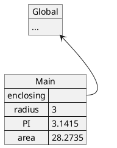
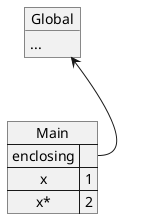
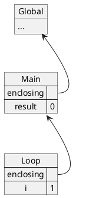
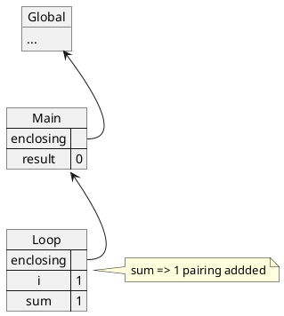
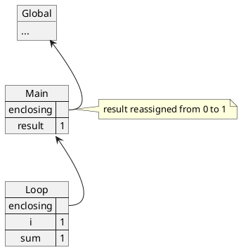
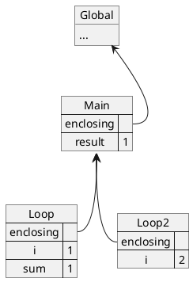
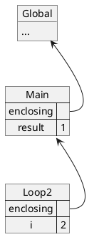
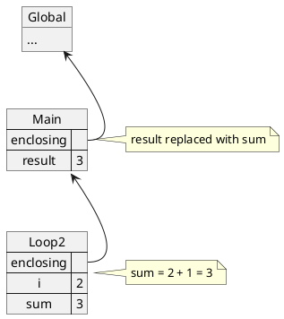
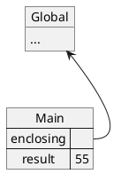

# 3. Repetition

Having conditional statements is a good first step towards writing more complex how-to of solving complex problems.

But we are still limited in the sense that we might need to repeat certain operations multiple times.

Take the example of computing the multiplication of 2 positive whole numbers:

$$
x \times y = x_1 + x_2 + ... + x_{y-1} + x_y
$$

With the current mechanisms introduced, one way of achieving the above implementation is through the following:

```js
function multiplyWholeNumbers(x, y) {
    if (x === 0 || y === 0) {
        return 0;
    } else if (x === 1) {
        return y;
    } else if (y === 1) {
        return x;
    } else {
        return x + multiplyWholeNumbers(x, y - 1);
    }
}
```

Let's try evaluating the following function-application expression:

```js
multiplyWholeNumbers(2, 2);
```

1. The function will first set both `x` and `y` to $2$.
2. The function test each of the condition, and since `x` and `y` are neither $1$ or $0$, none of the condition will be true and hence we will evaluate the `else` clause, the `final-alternative-statements`.
3. Here we want to evaluate `return x + multiplyWholeNumbers(x, y - 1)`
    1. Before we can return, we will have to first evaluate `x + multiplyWholeNumbers(x, y - 1)`, specifically, we will evaluate the left and right hand side of the `+` operator.
        1. On the left hand side, we have the variable `x` which will be substituted with the value $2$.
        2. On the right hand side, we have another function-application expressions `multiplyWholeNumbers(x, y-1)`
            1. Hence, we first evaluate the function-expression, substituting the name with the associated function.
            2. Then we evaluate the argument-expressions, there are 2 expressions
                1. The first is `x`, where we can simply substitute it with its value of $2$.
                2. The second is `y-1`, which can be substituted with $2 - 1 = 1$
            3. Now we apply the function to the given values `multiplyWholeNumbers(2, 1)`
                1. Now the function will once again set `x` to $2$ and `y` to $1$.
                2. The function will test each condition and will detect that `y === 1` is `true`.
                    1. Hence, `multiplyWholeNumbers(2, 1)` will simply return `x` which is $2$
        3. So now we have the both the left and right hand side value (both $2$), so we can apply the `+` operator, giving us the value of $4$.
    2. So now the function can return the value $4$

The above utilizes a technique called `Recursion`, which while powerful in many ways, will be rarely used (or almost never) in your course of study here. Hence, we will introduce another mechanism which you would be encountering more often.

## 3.1 For-statement

We can implement `multiplyWholeNumbers(x, y)` using the for-statement:

```js
function multiplyWholeNumbers(x, y) {
    let result = 0;
    for (let i = 0; i < y; i = i + 1) {
        result = result + x;
    }
    return result;
}
```

More formally:

```js
for1️⃣ (initialization2️⃣; condition3️⃣; afterthought4️⃣) {
    loop-statements5️⃣;
}
```

1. The for-statement starts with the keyword `for`. It is followed by a parenthesis of 3 expressions, each separated by a semi-colon (`;`)
2. The first part, the initialization, the expression to be evaluated before the start of the loop cycles.
3. The second part, the condition, the expression that if evaluated to `true` will continue with the cycle, otherwise, if `false`, will exit the cycle.
4. The third part, the afterthought, an expression to be evaluated at the end of each cycle.
5. The statements to be executed for each loop.

Visually:

```
         Start
           ▼
    [2]initialization
           ▼
┌────►[3]condition ──┐
│          │ true    │false
│          ▼         │
│ [5]loop-statements │
│          ▼         │
└─── [4]afterthought │
                     │
        End◄─────────┘
```

Let's apply the `multiplyWholeNumbers(x, y)` function:

```js
multiplyWholeNumbers(2, 5);
```

1. The function starts by assigning $2$ and $5$ to their parameters `x` and `y` respectively.
2. The function uses the `let` keyword to initialize a mutable variable named `result` with the value $0$. (This is the variable that will store the accumulated result of each cycle)
3. It starts the `for-statement`
    1. Starting with the initialization, it uses the `let` keyword to initialize a variable named `i` with the value $0$. (This is the variable that will keep count of the number of times the cycle has been executed)
    2. Then moving to the condition, it checks whether `i` is smaller than `y`. Substituting the values accordingly we get $0 \lt 5$, which is `true`, hence we proceed to evaluate the `loop-statements`
    3. In this case, there is only 1 statement `result = result + x`, substituting the variables with their corresponding values we get `result = 0 + 2 = 2`. So, the variable `result` is now updated to $2$
    4. It moves on to the afterthought, where `i = i + 1`, substituting the values accordingly, we get `i = 0 + 1 = 1`. So, the variable `i` is now updated to $1$.
    5. The cycle returns back to the condition, checking whether `i < y`. Substituting the values, we get $1 \lt 5$, which is `true`, hence we proceed to evaluate the `loop statements` once again.
    6. Similarly, there's still only 1 statement, which adds `x` to `result`, updating `result` to $4$
    7. It move on to the afterthought, where `i = i + 1`, hence, the variable `i` is now updated to $2$.
    8. The cycle returns back to the condition, checking again whether `i < y`. This will repeat a few times, and the following summarizes how the values changes over each cycle:
        1. $1^{st}$ cycle: $i = 0, result = 0$. Condition: $i \lt y$ is `true`. Afterthought: $i = 1, result = 2$
        2. $2^{nd}$ cycle: $i = 1, result = 2$. Condition: $i \lt y$ is `true`. Afterthought: $i = 2, result = 4$
        3. $3^{rd}$ cycle: $i = 2, result = 4$. Condition: $i \lt y$ is `true`. Afterthought: $i = 3, result = 6$
        4. $4^{th}$ cycle: $i = 3, result = 6$. Condition: $i \lt y$ is `true`. Afterthought: $i = 4, result = 8$
        5. $5^{th}$ cycle: $i = 4, result = 8$. Condition: $i \lt y$ is `true`. Afterthought: $i = 5, result = 10$
        6. $6^{th}$ cycle: $i = 5, result = 10$. Condition: $i \lt y$ is `false`. End loop cycle
4. Hence, by the time it reaches the return statement, the `result` variable would be associated with the value $10$, which correctly calculate the multiplication of x and y.

## 3.2 Modeling program memory

In the previous lectures, you would notice that we predominantly made use of `const`, but in for-statement, we now require the use of `let` to help use keep track of information.

With the use of `let`, a variable is not merely just a name associated to a value, this name is now a `place` in which value is stored. In modelling the program memory, these `place` will be maintained in a structure called environments.

An environment is made up of a sequence of frames:

1. Each frame is series of key-value pairs, associating names with their corresponding value.
2. Each frame also has a reference to its enclosing environment.

An example:

```js
const radius = 3;
const PI = 3.1415;
const area = PI * radius * radius;
```

The above would have the following



We previously described that once a variable is declared (either using `let` or `const`) it cannot be declared again, for example:

```
> let x = 1;
> let x = 2;
Uncaught SyntaxError: Identifier 'x' has already been declared
```

Using the environmental model, we can understand this by describing that each frame may contain at most one binding for any name, so the following would be invalid:



There can't be 2 `x` binding within the same frame.

### 3.2.1 Modelling for-statements

Take the following for-statement that adds number from 1 to 10 as an example:

```js
1.  let result = 0;
2.  for (let i = 1; i <= 10; i = i + 1) {
3.      const sum = result + i;
4.      result = sum;
5.  }
6.  console.log(result);
7.  console.log(i);
```

By the time the program reaches line 3 (just entered the loop-statement), the environment would look like the following:



2 things to note:

1. The for-statement, with the `{ }` creates a new frame with the `Main` frame as its enclosing environment.
2. The variable `i` and `sum` is created in the `Loop` frame instead of the `Main` frame. (This would help explain the behavior at line 7. later)

When evaluating line 3 (`const sum = i + result`) the following happens:

1. We first seek to evaluate `i + result`, to do so:
    1. We first replace `i` with its corresponding value, to determine the corresponding value, we will look in the current frame, the `Loop` frame. In there, we see that `i` is associated with the value `1`.
    2. Thereafter, we replace `result` with its corresponding value. Similarly, we try to find `result` in the `Loop` frame. As the `Loop` frame does not have `result`, it would go to its enclosing environment, `Main`. In `Main`, it would then find that `result` is associated to the value `0`
    3. Having obtain the 2 values, it would then add the two together obtaining the value `1`.
2. Next, replacing `i + result` with 1, we will hence evaluate `const sum = 1`.
    1. This statement will create a new key-value pair in the frame, associating `sum` to the value `1`.



Thereafter, in line 4, it reassigns `result` with `sum`. Which updates the `result` in the `Main` frame with the value of `sum` in the `Loop` frame.



At the end of the loop-statement, the afterthought expression `i = i + 1` is executed, creating a new frame for the next iteration



Since the first loop is completed, it can then be destroyed from memory, leaving us with only the `Loop2` frame.



After execution of `afterthought`, we would evaluate the `condition` to determine if we should enter the loop-statements. It would test whether `i <= 10` is `true`. It would replace `i` with `2`, and the statement `2 <= 10` would evaluate to true.

Since the condition evaluates to `true`, it would enter the loop-statements, and once again evaluating the `const sum = i + result` statement. This time, `i` is replaced with `2` and `result` is replaced with `1`, resulting in `3`.

It then execute line 4 `result = sum`, updating `result` with the associated value in `sum`.



Fast forwarding, after the last iteration is executed, result would be the sum of 1 to 10 (i.e. $1 + 2 + .... 9 + 10 = 55$). Since the loop has all been completed, the frame created from the for-statement would be destroyed, leaving us with the following environment:



Hence, when we execute line 6, we would see 55 being displayed. But when we execute line 7, we would get a ReferenceError:

```
> for (let i = 1; i <= 10; i = i + 1) {
... const sum = result + i;
... result = sum;
... }
> console.log(result);
55
> console.log(i);
Uncaught ReferenceError: i is not defined
```

This is because, in the current environment, `i` is no longer found in any frames. Hence, a `ReferenceError` would be thrown.

## 3.3 Common Errors

### 3.3.1 Infinite Loop

Consider the following:

```js
for (let i = 0; i > 0; i++) {
    ...
}
```

If you try to evaluate the for-statement, you would realize that at the `condition` step, it will always be `true`. This means that the for-statement will never end. Resulting in what is called an Infinite Loop (a loop that doesn't end).

Hence, it is always important to consider whether your loop will end eventually.

### 3.3.2 Off-by 1

Consider the following implementation of the `multiplyWholeNumbers(x, y)` function:

```js
function multiplyWholeNumbers(x, y) {
    let result = 0;
    for (let i = 0; i <= y; i = i + 1) {
        result = result + x;
    }
    return result;
}
```

Try tracing the execution of `multiplyWholeNumber(2, 5)` again, you would realize that you obtain the result 12 instead of 10. That is, the above code added `result` with `x` 1 additional time. This is because the condition uses `<=` instead of `<`, when `<=` is used, it will end the cycle only when the left hand side is greater than the right hand side.

Similarly, if it was implemented as follows:

```js
function multiplyWholeNumbers(x, y) {
    let result = 0;
    for (let i = 1; i < y; i = i + 1) {
        result = result + x;
    }
    return result;
}
```

Try tracing the execution of `multiplyWholeNumber(2, 5)` again, you would realize that you obtain the result 8 instead of 10. That is, the above code added `result` with `x` 1 lesser time. This is because the variable `i` was initialized to $0$ instead of $1$, this will reduce the cycle by 1 time.

Hence it is important to count the number of cycles carefully.

## 3.4 More examples

```js
function sumNumberFrom1ToN(n) {
    let sum = 0;
    for (let i = 1; i <= n; i = i + 1) {
        sum = sum + i;
    }
    return sum;
}

sumNumberFrom1ToN(10);
```

55 (1 + 2 + 3 + ... + 8 + 9 + 10)

```js
function absolute(n) {
    if (n >= 0) {
        return n;
    } else {
        return n * -1;
    }
}

function isDivisibleBy2(n) {
    let countdown = absolute(n);

    for (let i = 0; i < n; i = i + 2) {
        countdown = countdown - 2;
    }

    if (countdown === 0) {
        return true;
    } else {
        return false;
    }
}

function sumEvenNumberFrom1ToN(n) {
    let sum = 0;
    for (let i = 1; i <= n; i = i + 1) {
        if (isDivisibleBy2(i)) {
            sum = sum + i;
        }
    }
    return sum;
}

sumEvenNumberFrom1ToN(10);
```

30 (2 + 4 + 6 + 8 + 10)

```js
function sumOddNumberFrom1ToN(n) {
    return sumNumberFrom1ToN(n) - sumEvenNumberFrom1ToN(n);
}

sumOddNumberFrom1ToN(10);
```

25 (1 + 3 + 5 + 7 + 9)

## 3.X Summary

We started with the problem where with only functions and variables, we are limited to a linear, sequential manner of executing the program. With the introduction of Boolean, Conditional Statements, and Logical Composition Operators, we now have the tools to take different actions based on different conditions.

Furthermore, we now introduces a iteration mechanism, allowing us to repeat a certain set of instructions multiple times. This serves as yet another mechanism to allow us to combine together simple ideas to form more complex ideas.

## 2 & 3 Summary

In the past 2 chapters it was intentional that we focused on how the program flow. How it processed branching logic with if-statements, and how it processed iteration with for-statements.

One aspect that we have neglected is how `memory` is handled. How does the environment keep track of the name-value pair. Why is `i` declared in multiple places but yet it does not interfere with each other? And that will be the focus of the next topic.
