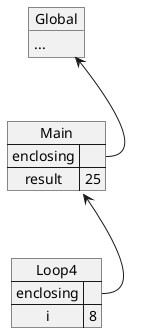

# Tutorial 3

In this tutorial, we will aim to gain more familiarity with the for-statement. Focusing on the following:

1. For-statement
2. Environment Model
3. Common Errors

## 3.1 For-statement

As a recap, here's the structure of a for-statement:

```js
for (initialization; condition; afterthought) {
    loop - statements;
}
```

With the following flow:

```
       Start
         ▼
    initialization
         ▼
┌────► condition ──┐
│        │ true    │false
│        ▼         │
│  loop-statements │
│        ▼         │
└───  afterthought │
                   │
      End◄─────────┘
```

## 3.2 Environment Model

In the lecture, we introduced a model in which we can use to help us track the value of variables as the program is being evaluated.

Try tracing the execution of the following code, drawing out the environment as you do so:

```js
1.  function sumFromMtoN(m, n) {
2.      let result = 0;
3.      for (let i = m; i <= n; i++) {
4.          result = result + i;
5.      }
6.      return result;
7.  }

8.  console.log(sumFromMtoN(3, 7));
```

Right before the program exists the loop and reaches line 6, your environment should look like the following:



## 3.3 Try it out!

### 3.3.1 sumFrom1ToN

Complete the following function that sum numbers from `1` to `n`:

> Hint: Refer to the `multiplyWholeNumbers(x, y)` example in the lecture.

```js
function sumFrom1ToN(n) {}

console.log(sumFrom1ToN(1));
console.log(sumFrom1ToN(2));
console.log(sumFrom1ToN(3));
console.log(sumFrom1ToN(5));
console.log(sumFrom1ToN(10));
```

Expected output:

```
1
3
6
15
55
```

### 3.3.2 repeat

Complete the following function that builds a new string by repeating a given string multiple times.

```js
function repeat(string, n) {}

console.log(repeat('hello', 1));
console.log(repeat('hello', 2));
console.log(repeat('*', 3));
console.log(repeat('*#', 4));
```

Expected output

```
hello
hellohello
***
*#*#*#*#
```

### 3.3.3 rightAngledTriangle

Complete the following function that prints an isosceles right angled triangle of varying height.

> Hint: Use the `repeat` function

```
height = 1
*

height = 2
*
* *

height = 3
*
* *
* * *

height = 4
*
* *
* * *
* * * *
```

```js
function rightAngledTriangle(height) {}

console.log(rightAngledTriangle(3));
console.log(rightAngledTriangle(4));
```

## 3.4 Common errors

In the lecture, we covered 2 common errors:

1. Infinite-loop - Happens when the loop does not terminate
2. Off-by-1 - Happens when a logic error causes the loop to repeat by 1 additional or 1 less times.

Take a look at the following implementation of a function that checks if a number is odd. Without executing the code, determine if the implementation is (1) Correct, (2) infinite-loop, or (3) off-by-1

```js
// A
function isOdd(x) {
    let i;
    for (i = x; i < 0; i = i - 2) {}
    return i !== 0;
}

isOdd(3);
isOdd(4);
```

```js
// B
function isOdd(x) {
    let i;
    for (i = x; i >= 0; i = i - 2) {}
    return i !== 0;
}

isOdd(3);
isOdd(4);
```

```js
// C
function isOdd(x) {
    let i;
    for (i = x; i > 0; i = i - 2) {}
    return i !== 0;
}

isOdd(3);
isOdd(4);
```

## 3.X Summary

Thus far we have covered the following concepts:

1. Elements of programming
    1. Primitives - String, Numbers, Booleans
    2. Means of combination - Operators, Functions
    3. Means of abstraction - Variables, Functions
2. Conditions
    1. If-statements
    2. Comparison Operators
    3. Boolean Composition Operators
3. Loops
    1. For-statements
    2. Environmental Model
    3. Common errors - off-by-1, infinite loop

The next step is to expand the environmental model further and to see how it can be used to model functions and if-statements.
