# 4. Environmental Model

We have seen in topic 3 how environmental model can be used to help model the memory state when evaluating a program consisting of for-statements.

In this topic, we will see how it can be used to model Functions and If-statements too.

## 4.1 Modeling functions and function calls

Take the following code as example:

```js
1.  function sum(x, y) {
2.      return x + y;
3.  }

4.  function square(x) {
5.      return x * x;
6.  }

7.  function sumOfSquare(x, y) {
8.     return sum(square(x), square(y));
9.  }

10. sumOfSquare(3, 4);
```

Recall the distinction of `function delcaration` and `function application`. Line 1-3 is a `function declaration` where the function is being created, that is it only creates the function but does not executes it. It is only executed when the `function application` expression in line 8 is executed.

That is, by the time the program evaluated the `function declaration` for `sum`, `square`, and `sumOfSquare`, the environment have simply _created_ the functions:

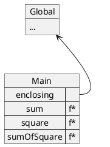

> **Note:** For simplicity, `f*` here simply represents that it's a function, we will in topic 5 explore a more accurate representation of how a function is stored in the program.

Thereafter, in line 10, we have our first `function application` expression, which invokes the `sumOfSquare` functions. This creates another frame:

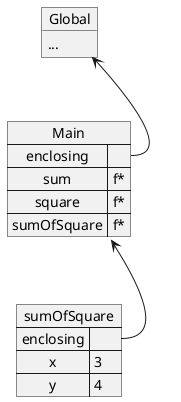

In which, `sumOfSquare` would then invoke the `square` function twice (`square(x)` and `square(y)`, where `x` and `y` are `3` and `4` respectively):

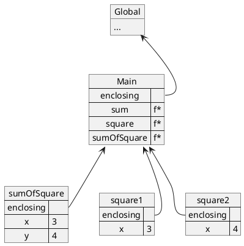

Notice how despite having declared the variable `x` multiple times, there are no conflict? It is because each of the `x` is created within its own frame.

### 4.1.1 Tracking mutation

In the above example, we are not changing the values of any variables. The usefulness of the environmental model would become more apparent when functions mutates variables. Take the following as an example:

```js
1.  let count = 0;

2.  function increment(x) {
3.      count = count + x;
4.  }

5.  function decrement(x) {
6.      count = count - x;
7.  }

8.  increment(5);
9.  increment(3);
10. decrement(6);
```

After the first 7 lines, the variable `count` and the 2 functions `increment` and `decrement` is created

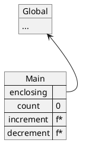

When the first `function application` expression (`increment(5)`) is evaluated, it creates a new frame as follows:

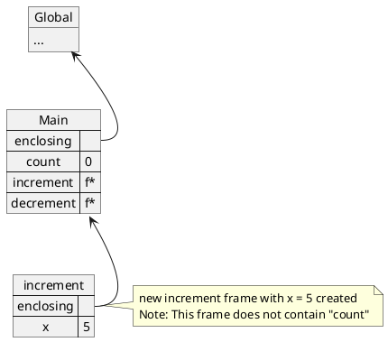

Within the function, it executes the statement `count = count + x`. Within the `increment` frame, there is no `count`, it will hence look to it's enclosing frame, the `Main` frame, and find that `count` is associated with the number `0`.

Hence `count + x` will be evaluated to `0 + 5` resulting in the value `5`. It will then be reassigned to the `count` variable, also in the `Main` frame.

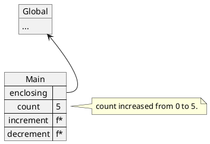

Thereafter, in line 9, again we execute `increment(3)`.

It first creates the new `increment` frame:


Then it executes `count = count + x`, substituting `count` with 5, and `x` with 3, resulting in `count = 8`. Hence after executing the function we have the following:


And finally, in line 10, we have decrement(6), which behaves very similarly to increment but minus away some value instead.

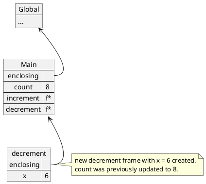

It then evaluates the statement `count = count - x`, subtituting `count` with `8` and `x` with `6`, resulting in `count = 2`. Hence after executing the function we have the following:

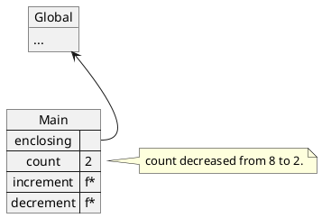

## 4.2 Adding if-statement and for-loop into the mix

In the previous topics and the examples above, we largely focused on visualizing the environment with only 1 concept involved. Let's put everything together and see how it can be applied to everything. Consider the following function:

```js
let sign = 1;

function resetSign() {
    sign = 1;
}

function flipSign() {
    let newSign;
    if (sign === 1) {
        newSign = -1;
    } else {
        newSign = 1;
    }
    sign = newSign;
}

function computeAlternatingSum(n) {
    let result = 0;
    for (let i = 1; i <= n; i = i + 1) {
        result = result + sign * i;
        flipSign();
    }
    resetSign();
    return result;
}

console.log(computeAlternatingSum(7));
```

At the start of the program, the variable `sign` and the 3 functions will be created in the `Main` frame.

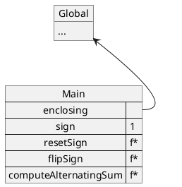

When it reaches the last line and executes `computeAlternatingSum(7)`, it creates a new frame:

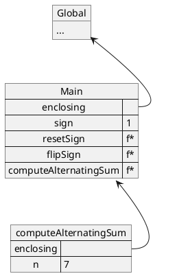

It then creates a new variable `result` within the frame:

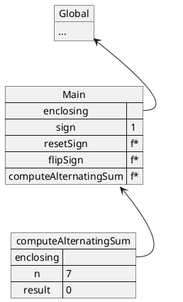

It then starts a `for-statement`, creating a frame for each iteration:

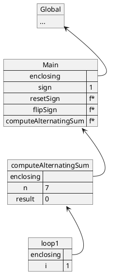

In this loop, it does a few things:

1. It checks whether the condition (`i <= n`) is true, `i` is found in the `loop1` frame, and `n` is found in the `computerAlternatingSum` frame, substituting the value we get `1 <= 7` which evaluates to `true`. Hence we will enter the `loop-statements`
2. In which we execute `result = result + sign * i`, substituting the names accordingly we get:

    1. `result` => `0`, from `computerAlternatingSum` frame
    2. `sign` => `1`, from `Main` frame
    3. `i` => `1`, from `loop1` frame.
    4. After substituting, we get `result = 0 + 1 * 1` or simply: `result = 1`, this updates the `result` variable in the `computeAlternatingSum` frame.

        ```plantuml
            @startuml
            object Global {
                ...
            }
            map Main {
                enclosing =>
                sign => 1
                resetSign => f*
                flipSign => f*
                computeAlternatingSum => f*
            }

            map computeAlternatingSum {
                enclosing =>
                n => 7
                result => 1
            }
            note right {
                result updated to 1
            }

            map loop1 {
                enclosing =>
                i => 1
            }

            Global <-- Main::enclosing
            Main <-- computeAlternatingSum::enclosing
            computeAlternatingSum <-- loop1::enclosing
            @enduml
        ```

    5. Thereafter, it executes `flipSign()`, creating a `flipSign` frame

        ```plantuml
            @startuml
            object Global {
                ...
            }
            map Main {
                enclosing =>
                sign => 1
                resetSign => f*
                flipSign => f*
                computeAlternatingSum => f*
            }

            map computeAlternatingSum {
                enclosing =>
                n => 7
                result => 1
            }

            map loop1 {
                enclosing =>
                i => 1
            }

            map flipSign {
                enclosing =>
            }

            Global <-- Main::enclosing
            Main <-- computeAlternatingSum::enclosing
            Main <-- flipSign::enclosing
            computeAlternatingSum <-- loop1::enclosing
            @enduml
        ```

    6. In there, it does the following:

        1. creates a new variable `newSign`
        2. It then evaluates the condition (`sign === 1`). Since `sign` is not within the `if1` frame, it would follow the `enclosing` chain until it reaches the `Main` frame where it finds that `sign` is associated to the value `1`. Replacing it gives us `1 === 1`, which evaluates to `true`.
        3. It hence goes into the first `consequent-statement` which also creates a frame:

        ```plantuml
            @startuml
            object Global {
                ...
            }
            map Main {
                enclosing =>
                sign => 1
                resetSign => f*
                flipSign => f*
                computeAlternatingSum => f*
            }

            map computeAlternatingSum {
                enclosing =>
                n => 7
                result => 1
            }

            map loop1 {
                enclosing =>
                i => 1
            }

            map flipSign {
                enclosing =>
                newSign =>
            }
            map if1 {
                enclosing =>
            }

            Global <-- Main::enclosing
            Main <-- computeAlternatingSum::enclosing
            Main <-- flipSign::enclosing
            computeAlternatingSum <-- loop1::enclosing
            flipSign <-- if1::enclosing
            @enduml
        ```

    7. In the first `consequent-statement`:

        1. It sets the `newSign` variable to `-1`.
        2. Thereafter, as it exits the `if-statement`, it then executes `sign = newSign`.
        3. Since `newSign` is `-1`, `sign`, in the `Main` frame will also be updated to `-1`:

        ```plantuml
            @startuml
            object Global {
                ...
            }
            map Main {
                enclosing =>
                sign => -1
                resetSign => f*
                flipSign => f*
                computeAlternatingSum => f*
            }

            note right {
                sign updated to -1

                flipSign and if1 frame is cleared
                after the function has finished execution
            }

            map computeAlternatingSum {
                enclosing =>
                n => 7
                result => 1
            }

            map loop1 {
                enclosing =>
                i => 1
            }

            Global <-- Main::enclosing
            Main <-- computeAlternatingSum::enclosing
            computeAlternatingSum <-- loop1::enclosing
            @enduml
        ```

    8. The loop then ends, an the `afterthought` (`i = i + 1`) is executed and hence creates the next frame:

        ```plantuml
            @startuml
            object Global {
                ...
            }
            map Main {
                enclosing =>
                sign => -1
                resetSign => f*
                flipSign => f*
                computeAlternatingSum => f*
            }

            map computeAlternatingSum {
                enclosing =>
                n => 7
                result => 1
            }

            map loop2 {
                enclosing =>
                i => 2
            }

            Global <-- Main::enclosing
            Main <-- computeAlternatingSum::enclosing
            computeAlternatingSum <-- loop2::enclosing
            @enduml
        ```

    9. The entire cycle then repeats

        1. We first compute the new `result`
            1. `result = result + sign * i`
            2. `result` => `1` from `computeAlternatingSum` frame
            3. `sign` => `-1` from `Main` frame
            4. `i` => `2` from `loop2` frame
            5. Hence, `result = 1 + -1 * 2 = -1`
        2. We then execute `flipSign()`, which would result in changing `sign` in the `Main` from from `-1` to `1`.
        3. As the execution completes, the `flipSign` frame is destroyed, and the `afterthought` (`i = i + 1`) is executed, creating the next loop frame.

        ```plantuml
            @startuml
            object Global {
                ...
            }
            map Main {
                enclosing =>
                sign => 1
                resetSign => f*
                flipSign => f*
                computeAlternatingSum => f*
            }
            note right {
                sign flipped from -1 to 1
            }

            map computeAlternatingSum {
                enclosing =>
                n => 7
                result => -1
            }
            note right {
                result changed from 1 to -1
            }

            map loop3 {
                enclosing =>
                i => 3
            }
            note right {
                Loop's afterthought increments i to 3
            }

            Global <-- Main::enclosing
            Main <-- computeAlternatingSum::enclosing
            computeAlternatingSum <-- loop3::enclosing
            @enduml
        ```

    10. This cycle will keep repeating itself and the following table summarizes the changes of `i`, `result`, and `sign`

        | i   | sign | result      |
        | --- | ---- | ----------- |
        | 1   | 1    | 0 + 1 = 1   |
        | 2   | -1   | 1 + -2 = -1 |
        | 3   | 1    | -1 + 3 = 2  |
        | 4   | -1   | 2 + -4 = -2 |
        | 5   | 1    | -2 + 5 = 3  |
        | 6   | -1   | 3 + -6 = -3 |
        | 7   | 1    | -3 + 7 = 4  |

## 4.X Summary

In this topic, you've been introduced to another new tool, the environmental model to help assist you in tracking the values of the variables.

A summary of topics so far:

1. **Topic 1**: Substitution model, functions
2. **Topic 2**: if-statements
3. **Topic 3**: for-statements
4. **Topic 4**: Environmental model.

substitution mode, functions, if-statements, and for-statements provides you with the concepts needed in understanding the sequence in which expressions are evaluated.

Environmental model provides you with a means needed to keep track of the values as the program is evaluated.

In the next few topics, we will begin to build upon these concepts to create new forms of `Data`.

That is, in the first chapter, it was briefly mentioned that _"In every program, we deal with two kinds of elements: Data (as in values) and Functions (as in description of the rules for manipulating data)"_. While we have worked with various primitive data such as `Numbers`, `Strings`, and `Boolean`, we will begin to explore other forms of data, and create our own kinds of data too.
