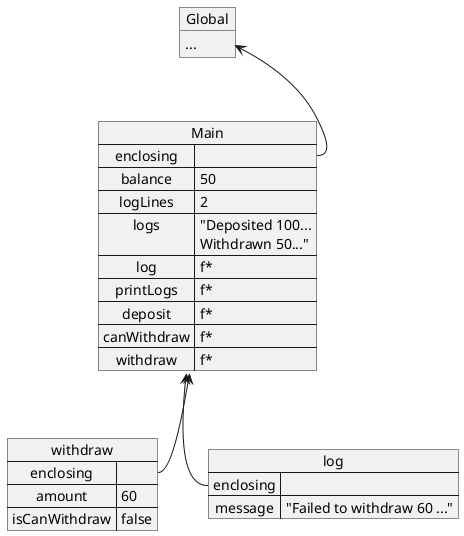

# Tutorial 4

In this tutorial, we will aim to gain more fluency with using the environmental model in tracing the execution flow while keeping track of the memory states.

## 4.1 Environmental Model

A recap, the environment of a program is made up of `frames`, where each frame have the following:

1. A name-value pairing, where each name in the frame is associated with a value.
2. A `enclosing environment` pointer which reference the environment in which it would look to if a particular name is not found within the frame.
3. Each frame is created whenever codes are enclosed by curly braces `{ }`, for example in functions declarations, if-statements, and for-statements.

## 4.2 Try it out

> You might want to prepare paper/pencil or whiteboard/marker for this exercise
>
> You will need to write and erase as you trace.

Trace the execution of the following and draw out the environment as it changes.

### 4.2.1 Bank account

```js
1.  let balance = 0;

2.  function deposit(amount) {
3.      balance = balance + amount;
4.  }

5.  function canWithdraw(amount) {
6.      let current = balance;
7.      current = current - amount;
8.      return current >= 0;
9.  }

10. function withdraw(amount) {
11.     const isCanWithdraw = canWithdraw(amount);
12.     if (isCanWithdraw) {
13.         balance = balance - amount;
14.         return amount;
15.     } else {
16.         return -1;
17.     }
18. }

19. deposit(100);
20. withdraw(50);
21. withdraw(60);
```

### 4.2.2 Bank account with logs

```js
1.  let balance = 0;
2.  let logLines = 0;
3.  let logs = '';

4.  function log(message) {
5.      logLines = logLines + 1;
6.      logs = logs + '\n' + message;
7.  }

8.  function printLogs() {
9.      console.log(logs);
10. }

11. function deposit(amount) {
12.     balance = balance + amount;
13.     log('Deposited ' + amount + ', current balance: ' + balance);
14. }

15. function canWithdraw(amount) {
16.     let current = balance;
17.     current = current - amount;
18.     return current >= 0;
19. }

20. function withdraw(amount) {
21.     const isCanWithdraw = canWithdraw(amount);
22.     if (isCanWithdraw) {
23.         balance = balance - amount;
24.         log('Withdraw ' + amount + ', current balance: ' + balance);
25.         return amount;
26.     } else {
27.         log('Failed to Withdraw ' + amount + ', Insufficient value!');
28.         return -1;
29.     }
30. }

31. deposit(100);
32. withdraw(50);
33. withdraw(60);
34. printLogs();
```

### 4.2.2.1 Which line is it?

At which line will we have the following environment?



### 4.2.3. Is odd?

Without executing the code, what outcome do you think the following code will produce? Try using the environment model to trace the execution to explain your choice.

> Hint: Recall that the frame is destroyed once the code within the `{ }` has finished executing. (e.g. when the functions returns or reaching the end of the for-loop/if-else)

1. `true` - No errors
2. `ReferenceError` - `num` is not defined
3. `TypeError` - Assignment to constant variable `num`
4. `ReferenceError` - `i` is not defined

```js
1.  function isOdd(num) {
2.      for (let i = num; i > 0; i = i - 2) {
3.          // do nothing
4.      }
5.      if (i === 0) {
6.          return false;
7.      } else {
8.          return true;
9.      }
10. }

11. const num = 11;
12. console.log(isOdd(num));
```

### 4.X Summary

With the environmental model, you should now be equipped to trace and evaluate code.

In the second half of the module, we will now focus on how data is being stored, organized, and used to aid in the solving of problems.
