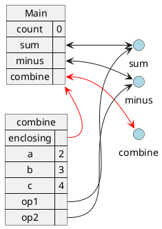
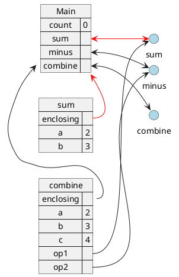
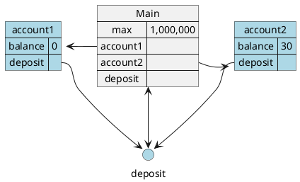
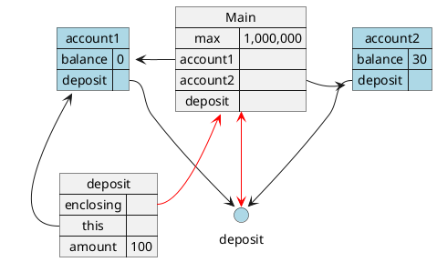
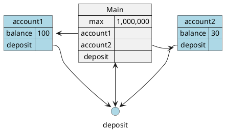

# 5. Thinking about data

In the previous 4 topics, we have focused on basic elements of programming, namely:

1. **Primitives** - Strings, numbers, booleans
2. **Means of combination** - operator combinations, function applications
3. **Means of abstraction** - Variables, Functions
4. **Various statements to control the flow of a program** - If-statements, for-statements
5. **Means of evaluating a program** - Substitution Model, Environmental Model.

In the subsequent topics, we will focus instead on means of storing and acting on data.

In the tutorial 4, we had a glimpse of this using the `Bank` example, where there were `data` such as `balance` and `logs`, and there were actions to work on these data such as `log`, `withdraw`, and `deposit`.

In your daily life, your wardrobe for example, is another example of the presence of `data` and `actions`. You have the ability to `keep` clothes into specific position, and `retrieve` a piece of clothe from a specific position. The way you store your clothes would affect the way you perform the `keep` and `retrieve` action.

Another example, your phone's contact list. The contact number of your family and friends are the `data` to be stored. The actions you can take includes `add`, `remove`, and perhaps `modify`. We will see again that the way the data is stored would affect how the actions are taken.

But before that, let's first introduce a new mechanism that would facilitate the storing of data. `Objects`.

Specifically, we will be looking at the following:

1. What is object
2. Creating Object
3. Accessing properties of an Object
4. Objects as reference-type
5. Functions as Object
6. Functions in Object

## 5.1 Objects

Objects, in JavaScript, is a structure that helps store data using a key-value pair mechanism. You have already experienced this sort of structure in the environmental model.

The following is a sample of this `Object` data structure:

```js
const obj = {
    name: 'John',
    age: 12,
    isMarried: false,
};
```

```plantuml
object Global {
    ...
}

map Main {
    enclosing =>
    obj =>
}

map obj #lightblue {
    name => "John"
    age => 12
    isMarried => false
}

Global <-- Main::enclosing
Main::obj -> obj
```

## 5.2 Object initializer expression

To create an object, you may use the `object initializer` expression.

The `object initializer` expression is a comma-separated list of property-value pair enclosed in curly braces `{}`:

```
{
    property1: value-expression1,
    property2: value-expression2,
    ...
}
```

In this module, we will simply assume that every `property` is a String. That is, even without the quotations, the properties are treated as string.

> Though strictly speaking, properties are also allowed to be [Symbols](https://developer.mozilla.org/en-US/docs/Web/JavaScript/Reference/Global_Objects/Symbol), which is not covered in this module.

Also, `value-expression` can be any expression. Hence, the following is also a valid object initializer expression:

```js
function sum(a, b) {
    return a + b;
}

const obj = {
    123: 1 + 2 + 3,
    sum123: sum(1, sum(2, 3)),
};
```

In the above example, `123` while written as a number is converted into a string. `1 + 2 + 3`, and `sum(1, sum(2, 3))` are evaluated first before being associated with their respective properties.

## 5.3 Property Accessors

To access the values within an object, you may use either the `dot` or `square bracket` notation. Both methods are operators, and hence a `means of combination`, and can be evaluated like any other operator using the substitution model and environmental model.

```
obj.propertyName
obj[expression]
```

### 5.3.1 Dot notation

In the `obj.propertyName` syntax, also known as the `dot notation`, the `propertyName` must be a valid identifier

> **Recap** from topic 1:
>
> `Identifiers`:
>
> 1. Are commonly made of alphanumeric characters (`a-zA-Z0-9`), underscores (`_`), and dollar signs (`$`).
> 2. Does not contain any whitespace
> 3. Are not allowed to start with numbers.
> 4. Cannot be a reserved `Keyword`

example:

```js
const person = {
    age: 19,
    name: 'John',
};

const message = 'The person ' + person.name + ' is ' + person.age + ' years old';

console.log(message);
```

There may however be situation where the property name either:

1. Is not a valid identifier (e.g. a number) or
2. Needs to be computed

Then you can utilize the `square-bracket notation`

### 5.3.2 Square-bracket notation

```
obj[expression]
```

For example, if you have the following object:

```js
const obj = {
    1: 'Tom',
    2: 'John',
    3: 'Sally',
};
```

Then you can't access the properties via the `dot-notation` as `1`, `2`, and `3` are numbers are not valid `identifiers`.

```js
const obj = {
    1: 'Tom',
    2: 'John',
    3: 'Sally',
};

obj.1
   ^^
Uncaught SyntaxError: Unexpected number
```

As the program here expects an `identifier`, a number is unexpected.

In this case, you can use the `square-bracket notation` instead:

```js
const obj = {
    1: 'Tom',
    2: 'John',
    3: 'Sally',
};

const message: 'First place: ' + obj[1] + ' Second place: ' + obj[2] + " Third place: " + obj[3];

console.log(message);
```

Alternatively, perhaps you need to programmatically compute the keys:

```js
const obj = {
    item1: 'Apple',
    item2: 'Orange',
    item3: 'Pear',
};

let message = '';

for (let i = 1; i <= 3; i++) {
    const property = 'item' + i;
    const newLine = i + '. ' + obj[property];
    message = message + newLine + '\n';
}

console.log(message);
```

### 5.3.3 Accessing a property that does not exists

When accessing a property that is not defined, the program would return undefined.

```js
const obj = {
    abc: 123,
    def: 456,
};

console.log(obj.ghi);
console.log(obj['ghi']);
```

Both `console.log` above would return `undefined`.

### 5.3.4 Assigning properties after initialization

After the object has been initialized, you can later assign or update values simply by using the `=` operator and any of the accessor methods. e.g.:

```js
const obj = {
    abc: 123,
    def: 456,
};

// new properties
obj['hij'] = 789;
obj.klm = 101112;

// updating properties
obj['abc'] = 131415;
obj.def = 161718;
```

### 5.3.5 Common errors

#### 5.3.5.1 Mixing up identifier with expressions

Recall that in the `dot notation`, you provide an `identifier`, whereas in the `square-bracket notation`, you provide an `expression`.

The following example mixes up the two:

```js
const obj = {
    abc: 123,
    def: 456
}

// a
obj."abc"

// b
obj[abc]
```

Here are the output of the above negative example:

```js
// a
> obj."abc"
obj."abc"
    ^^^^^

Uncaught SyntaxError: Unexpected string
```

The program expects an `identifier`, but was given a `string` instead.

```js
// b
> obj[abc]
Uncaught ReferenceError: abc is not defined
```

The program would evaluate `abc` as a variable, and find that the variable `abc` is not defined.

#### 5.3.5.2 Unable to access property of undefined

If you have a variable that is not defined and you try to access its property, you would be faced with the following error:

```js
function getAge(object) {
    return object.age;
}

let obj; // obj is undefined
console.log(getAge(obj));
```

```
Uncaught TypeError: Cannot read properties of undefined (reading 'age')
    at getAge (REPL3:2:19)
```

The above message suggests that you are trying to read the property of something that is undefined. In the context of `object.age`, the variable that is undefined is `object` and not `age`.

## 5.4 Primitive vs Objects: Pass by Reference

Referencing the diagram back in 5.1.1 (replicated below), we note that unlike primitive value like `string`, `numbers`, and `boolean`, an `Object` is not stored as value in the frame, but rather an _"arrow"_ points to it:

```js
const obj = {
    name: 'John',
    age: 12,
    isMarried: false,
};
```

```plantuml
object Global {
    ...
}

map Main {
    enclosing =>
    obj =>
}

map obj #lightblue {
    name => "John"
    age => 12
    isMarried => false
}

Global <-- Main::enclosing
Main::obj -> obj
```

The significance of it can be illustrated with the following example:

```js
const students = {
    p1234: 'John',
    p2345: 'Mary',
    p3456: 'Tom',
};
let numberOfStudents = 3;

function addStudent(id, name, allStudents, totalStudents) {
    allStudents[studentId] = studentName;
    totalStudent = totalStudent + 1;
}

addStudent('p4567', 'Larry', students, numberOfStudents);

console.log(students.p4567); // "Larry"
console.log(numberOfStudents); // 3
```

When the `addStudent(...)` function is applied, we have the following environment:

```plantuml
map Main {
    students =>
    numberOfStudents => 3
    addStudent => f*
}

map students #lightblue {
    p1234 => "John"
    p2345 => "Mary"
    p3456 => "Tom"
}

Main::students -> students

map addStudent {
    enclosing =>
    id => "p4567"
    name => "Larry"
    allStudents =>
    totalStudents => 3
}

Main <-- addStudent::enclosing
students <-- addStudent::allStudents
```

That is, when evaluating `allStudents[studentId] = studentName`, the variable `allStudents` is _pointing_ to the same `students` object, the assignment expression would hence modify the original `students` object.

```plantuml
map Main {
    students =>
    numberOfStudents => 3
    addStudent => f*
}

map students #lightblue {
    p1234 => "John"
    p2345 => "Mary"
    p3456 => "Tom"
    p4567 => "Larry"
}

note right {
    new entry "p4567" => "Larry" added
}

Main::students -> students

map addStudent {
    enclosing =>
    id => "p4567"
    name => "Larry"
    allStudents =>
    totalStudents => 3
}

Main <-- addStudent::enclosing
students <-- addStudent::allStudents
```

Whereas, the expression `totalStudent = totalStudent + 1` is treated differently. That is, while the value of `numberOfStudents` and `totalStudents` are the same, they are separate memory space. Reassigning to `totalStudents` would not affect `numberOfStudents`

```plantuml
map Main {
    students =>
    numberOfStudents => 3
    addStudent => f*
}

map students #lightblue {
    p1234 => "John"
    p2345 => "Mary"
    p3456 => "Tom"
    p4567 => "Larry"
}

Main::students -> students

map addStudent {
    enclosing =>
    id => "p4567"
    name => "Larry"
    allStudents =>
    totalStudents => 4
}

note right {
    totalStudents updated to 4
    But numberOfStudents remains at 3
}

Main <-- addStudent::enclosing
students <-- addStudent::allStudents
```

Here we describe that `Objects` are `pass-by-reference` whereas `Primitives` are `pass-by-value`. That like the example above, instead of duplicating the `students` object, the reference to the `students` object is being passed around instead. Similarly, primitives like the `numberOfStudents` value is being duplicated instead of passed using a reference.

## 5.5 Functions as Objects

All these while, we've treated functions as primitives, representing them as `f*` in environmental models. But more accurately, functions are objects and the following would be a more representative model:

```js
const num1 = 1;
const num2 = 2;
function sum(a, b) {
    return a + b;
}

sum(num1, num2);
```

```plantuml
map Main {
    num1 => 1
    num2 => 2
    sum =>
}

map "<<function>>\nsum" as sumf #lightblue  {
    environment =>
}

Main::sum -> sumf
Main <- sumf::environment
```

This `environment` key helps points the newly created frame to the right enclosing environment

```plantuml
map Main {
    num1 => 1
    num2 => 2
    sum =>
}

map "<<function>>\nsum" as sumf #lightblue  {
    environment =>
}

map sum {
    enclosing =>
    a => 1
    b => 2
}

Main::sum -> sumf
Main <- sumf::environment #red
Main <-- sum::enclosing #red
```

For simplicity and to keep the diagrams neat, we will simplify the function object with a circle with bi-directional arrow:

```plantuml
map Main {
    num1 => 1
    num2 => 2
    sum =>
}

() "sum" as sumf #lightblue

note right {
    Function object is now represented with a circle
    and simplified with Bi-directional arrow
}

map sum {
    enclosing =>
    a => 1
    b => 2
}

Main <-down- sum::enclosing #red
Main::sum <-right-> sumf #red

```

Take the following as an example:

```js
let count = 0;
function sum(a, b) {
    count = count + 1;
    return a + b;
}
function minus(a, b) {
    count = count + 1;
    return a - b;
}
function combine(a, b, c, op1, op2) {
    const result1 = op1(a, b);
    return op2(result1, c);
}

console.log(combine(2, 3, 4, sum, minus)); // (2 + 3) - 4
```

When the `combine` function application is evaluated, we have the following environment:



Notice how there are arrows _pointing_ from `op1` and `op2` to `sum` and `minus` respectively, this shows that the functions `sum` and `minus` are being passed as referenced to the `combine` function, that is, `sum` and `op1` are _pointing_ to the exact same function.

If we do an strict comparison of `op1` and `sum`, it will return `true`:

```js
function sum(a, b) {} // truncated for simplicity
function minus(a, b) {} // truncated for simplicity
function combine(a, b, c, op1, op2) {
    return op1 === sum;
}

console.log(combine(2, 3, 4, sum, minus)); // true
```

and when `op1` (which is `sum`) is applied:



Notice how `sum`, despite being called within `combine` knows to point its enclosing environment to `Main`. This is because, within the `sum` function object, it stores within it the environment in which it was created.

Now that we have a more accurate representation of `functions` as object, we can talk about having `functions` as values of `objects

## 5.6 Functions in Objects: Methods

So far, we have seen objects and function, and in the beginning of the topic we have also described how in every program, there is always the `data` and the `actions`.

When data are represented as an `Object`, we can also create functions that adjust their behavior based on which object they are attached to. These functions, called methods, use the `this` keyword to refer to the object they belong to, allowing the same function to work with different objects depending on how it is called.

Take the following example where an object represents a bank account, and there's a function that helps update the balance when money is being deposited:

```js
const max = 1000000; // max account value

// function to update bank balance
function deposit(amount) {
    if (this.balance + amount > max) {
        return -1;
    } else {
        this.balance = this.balance + amount;
    }
}

// bank accounts
const account1 = {
    balance: 0,
    deposit: deposit,
};
const account2 = {
    balance: 30,
    deposit: deposit,
};

account1.deposit(100);
account2.deposit(50);
console.log(account1.balance); // 100
console.log(account2.balance); // 80
```

After the creation of the `bank` object, we have the following environment:



and when the `deposit` function is applied through the `account1.deposit(100)` function application expression, the following frame is created:



With these set of arrows, we can now make sense of how the `deposit` function will be executed:

1. It starts with an if-statement, checking if `this.balance + amount` exceeds `max`.
    1. We first evaluate `this.balance`: `this` is _pointing_ to the `account1` object, hence `this.balance` is utilizing the `dot-notation` to access the `balance` property from the `account1` object. Which is `0`.
    2. We then evaluate `amount`, which is found within the `deposit` frame, which is `100`.
    3. Adding them gives us $0 + 100 = 100$.
    4. Thereafter we evaluate `max`: Following the `enclosing environment` _pointer_, it reaches the `Main` frame and finds `max`, which is `1000000`
    5. Finally we compare the two $100 > 1000000$ which gives us `false`
2. Since it's false, we will go to the alternative-statements, `this.balance = this.balance + amount`
    1. Again, `this` is the _pointer_ to the `account1` object, hence `this.balance` is the `balance` property of the `account1` object.
    2. `Amount` is `100`
    3. Hence, this statement updates the `balance` in the `account1` object by incrementing it by `100`.

Giving us this resulting environment:



### 5.6.1 What is `this`?

If you look back at the function, you would suddenly realize that there's a `this` that is magically _pointing_ at the `bank` object.

The keyword `this` is the mechanism that allows a function to apply the same behavior to whichever object that is bound to it.

In simple terms, when a function is applied as a property of an object (e.g. `object.function()` or `object[function]()`), the `object` is bounded to the `this` variable within the function's frame. For example:

```js
const obj1 = { name: 'John' };
const obj2 = { name: 'Tom' };

function x() {
    return this.name;
}

obj1.x = x;
obj2.x = x;

console.log(obj1.x()); // "John"
console.log(obj2.x()); // "Tom"
```

## 5.X Summary

In this lecture, we've explored deeply into one of the mechanism that would allow us to represent our data, and how we might apply actions on it.

We covered the mechanisms of objects:

1. How we can create an object using `object initializer` or also known as `object literal`
2. How it can store value as properties
3. How we might access them using property accessor operators (i.e. `dot-notation` and `square-bracket notation`)
4. How they are treated differently from primitives, that they are passed around by copying the reference rather than the copying the entire object.
5. How functions are actually objects and also passed around as reference.
6. How functions can be inside objects, serving as method, and how it uses `this` to adapt to different objects.

With these, we can then look to another structure that is built on-top of this, and how it may help us in solving problems.
