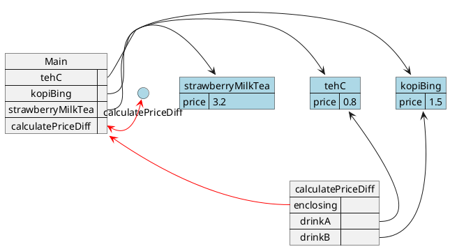
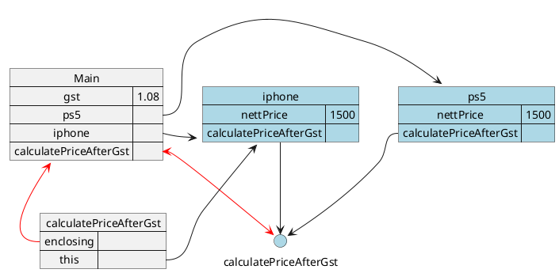

# Tutorial 5

In this tutorial, we will focus on gaining more fluency about Object and Functions. We will focus on the following:

1. How we can create an object using `object initializer` or also known as `object literal`
2. How `Objects` can store value as properties
3. How we might access them using property accessor operators (i.e. `dot-notation` and `square-bracket notation`)
4. How they are treated differently from primitives, that they are passed around by copying the reference rather than the copying the entire object.
5. How functions are actually objects and also passed around as reference.
6. How functions can be inside objects, serving as method, and how it uses `this` to adapt to different objects.

## 5.1 Working with Objects

In the pre class material, the following mechanism of an Object was explored:

1. Object initializer
2. Assigning new/Updating property
3. Property Accessor - Square notation
4. Property Accessor - Dot notation

### 5.1.1 Test yourself

The following code is labelled (`a`-`e`), identify the mechanism used in each of the labelled sections.

```js
// a
const laptop = {
    brand: 'apple',
    cost: 1999,
    '99SalePrice': 1000,
};

// b
let message = 'The brand of the laptop is: ' + laptop.brand;
message = message + '\nthe original price is: ' + laptop.cost;

// c
message = message + '\nthe discounted price on 9.9 is: ' + laptop['99SalePrice'];

// d
laptop.discount = laptop['cost'] - laptop['99SalePrice'];

// e
message = message + '\nYou will save: ' + laptop['discount'];
```

### 5.1.2 Dot-notation vs Square-notation

The following are wrong methods of accessing properties. Identify the reasons for each of the situation.

The possible reasons are:

1. Invalid identifier - Cannot start with number
2. Syntax Error - Unexpected String
3. Reference Error - Variable is not defined

```js
const laptop = {
    brand: "apple",
    cost: 1999,
    "99SalePrice": 1000,
}

// a
laptop[cost]

// b
laptop."cost"

// c
laptop.99SalePrice
```

### 5.1.3 Try it out

Complete the following functions, refer to the comments in the function for the expected behaviors:

```js
function createPlayer(playerName) {
    // Creates and returns an object
    // with a "name" property set to playerName,
    // and an "exp" property initialized to 0
}

function earnExp(player, exp) {
    // Adds `exp` to the player's "exp" property
}

function getLevel(player) {
    // Returns player level: 1 level per 10 exp, rounded down
    // Hint: You can use the roundDown function provided.
}

function getDisplayName(player) {
    // Returns the name and the level of the player (e.g. "John (Level 12)")
}

function roundDown(number) {
    // Round down a number (e.g. 10.1 => 10, 11.5 => 11, 13.9 => 13)
    return Math.floor(number);
}

const player1 = createPlayer('Tom');
const player2 = createPlayer('John');
earnExp(player1, 100);
earnExp(player2, 55);
console.log(getLevel(player1)); // 10
console.log(getLevel(player2)); // 5

earnExp(player1, 35);
earnExp(player2, 150);
console.log(getDisplayName(player1)); // Tom (Level 13)
console.log(getDisplayName(player2)); // John (Level 20)
```

## 5.2 Pass by Reference

Objects are passed around from functions to functions by reference.

Consider the following 2 pieces of code, the first without object and the second with object.

```js
const tehC = 0.8;
const kopiBeng = 1.5;
const strawberryMilkTea = 3.2;

function calculatePriceDiff(drinkA, drinkB) {
    drinkA = drinkA - drinkB;
    return drinkA;
}

console.log(calculatePriceDiff(tehC, kopiBing));
console.log(calculatePriceDiff(tehC, strawBerryMilkTea));
console.log(calculatePriceDiff(tehC, kopiBing));
```

If you tried executing the code below you would obtain the following output:

```
-0.7
-2.4
-0.7
```

Now, consider the following and guess the output before executing it

```js
const tehC = {
    price: 0.8,
};
const kopiBing = {
    price: 1.5,
};
const strawberryMilkTea = {
    price: 3.2,
};

function calculatePriceDiff(drinkA, drinkB) {
    drinkA.price = drinkA.price - drinkB.price;
    return drinkA.price;
}

console.log(calculatePriceDiff(tehC, kopiBing));
console.log(calculatePriceDiff(tehC, strawberryMilkTea));
console.log(calculatePriceDiff(tehC, kopiBing));
```

Once you have your guess, go ahead and try running the code.

Using the environmental model, come up with a reasoning as to why the output is different from the first code.

At the first console.log, you should have the following environment:



## 5.3 Enclosing function in object

In the above example, the functions are separated from the object. That is, when I pass the object around, it does not bring the function along.

Sometimes, we might want to package the function in together with the objects. For example, the JavaScript language comes with a few Objects that carries useful functions to assist us.

For example:

```js
console.log();
```

`console` here is an object, the object that represents the terminal, and it carries with it the method `log(...)` which prints something onto the terminal.

Other examples includes:

```js
Math.random(); // generates a random number from 0 to 0.99999...
Math.abs(); // returns the absolute of a number
Math.floor(); // round down a number
Math.ceil(); // round up a number
```

If you want a function that applies the same behavior but uses the values of specific object, you can use the `this` variable in the function:

```js
let gst = 1.08; // GST in 2023

function calculatePriceAfterGst() {
    return this.nettPrice * gst;
}

const iphone = {
    nettPrice: 1500,
    calculatePriceAfterGst: calculatePriceAfterGst,
};
const ps5 = {
    nettPrice: 700,
    calculatePriceAfterGst: calculatePriceAfterGst,
};

console.log('2023');
console.log('Price of iphone w/ GST: ' + iphone.calculatePriceAfterGst());
console.log('Price of ps5 w/ GST: ' + ps5.calculatePriceAfterGst());

gst = 1.09; // GST in 2024
console.log('2024');
console.log('Price of iphone w/ GST: ' + iphone.calculatePriceAfterGst());
console.log('Price of ps5 w/ GST: ' + ps5.calculatePriceAfterGst());
```

The `this` is bounded to the object whenever it is called as a method of that object. i.e.

```js
calculatePriceAfterGst(); // 'this' not bounded to any object
iphone.calculatePriceAfterGst(); // 'this' bounded to iphone
ps5.calculatePriceAfterGst(); // 'this' bounded to ps5
```

The environment model illustrates the binding effects:



### 5.3.1 Try it out

Complete the following functions:

```js
function calculateArea() {
    // returns the height multiplied by the width of the object
}

function calculateVolume() {
    // returns the area multiplied by the length of the object
}

let shippingFee = 1.15;

function calculateShippingFee() {
    // returns the volume multiplied by the shipping fee
}

function createParcel(width, length, height) {
    return {
        width: width,
        length: length,
        height: height,
        calculateArea: calculateArea,
        calculateVolume: calculateVolume,
        calculateShippingFee: calculateShippingFee,
    };
}

const boosterPack = createParcel(10, 10, 10);
const computer = createParcel(50, 100, 50);
const sofa = createParcel(100, 100, 50);

console.log('Booster Pack area:' + boosterPack.calculateArea()); // 100
console.log('Computer volume:' + computer.calculateVolume()); // 250000
console.log('Sofa Shipping Fee:' + sofa.calculateShippingFee()); // 575000

shippingFee = 2.4;
console.log('Computer ShippingFee:' + computer.calculateShippingFee()); //600000
```

## 5.X Summary

Now that we have a more complex data structure to store our data, we can now use it to solve problems.

For example, imagine building a system to perform computation on fractions.

$$
\frac{1}{2} \times \frac{3}{4}
$$

We can begin to think about

1. How do we store and represent out data? - i.e. The numerator and denominator
2. How do we implement the actions that can be acted on these data? - e.g. Addition of fraction, multiplication, and so on...
